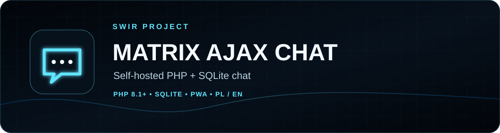
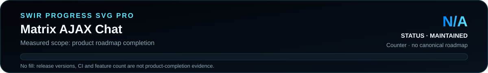
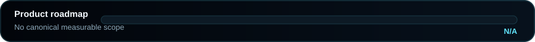

<!-- SWIR-README-STANDARD:v2 -->

<div align="center">



[](https://github.com/Swir/Matrix-Ajax-Chat/actions/workflows/ci.yml)
[](https://github.com/Swir)

[**Highlights**](#-highlights) · [**Install**](#-quick-start) · [**Security**](#-security--limitations) · [**Releases**](#-releases)
</div>

# Matrix AJAX Chat

A self-hosted PHP + SQLite chat with a responsive Matrix Blue interface, global and invitation-based private conversations, PL/EN UI, PWA support, hardened sessions/uploads and encrypted message storage.


## 📍 Project Status

<p align="center"></p>

| Item | Status |
|---|---|
| Current stage | Maintained v7.x web application |
| Runtime | PHP 8.1+ with SQLite |
| Latest public release | [v7.1.0](https://github.com/Swir/Matrix-Ajax-Chat/releases/tag/v7.1.0) |
| Product progress | **N/A** — no authoritative measurable roadmap exists |

## 🚀 Overview

v7 introduced the modular PHP architecture and security model. v7.1 restores useful behavior from the classic single-file build—terminal commands, latency display, sounds, fullscreen, private-chat shortcuts and legacy attachment compatibility—without returning to direct public upload paths.

## ✨ Highlights

| Feature | What it does |
|---|---|
| 💬 Chat | Global room plus invitation-based private conversations |
| 🌍 Language | Polish/English auto-detection with manual switching |
| 👤 Access | Registered accounts and guest access |
| 🔐 Storage encryption | AES-256-GCM for new messages with legacy CBC read compatibility |
| 🛡️ Web hardening | CSRF protection, regenerated sessions, hardened cookies and rate limits |
| 📎 Attachments | MIME/size validation and authenticated download/preview paths |
| 🗃️ Storage | SQLite WAL mode with indexed tables and presence cleanup |
| 📱 PWA | Manifest, service worker and installable icons |
| ⌨️ Terminal | `/help`, `/ping`, `/clear`, `/whoami` |
| 🧪 CI | PHP 8.1–8.4 tests plus JavaScript/PHP syntax validation |

## ⚙️ Quick Start

```bash
git clone https://github.com/Swir/Matrix-Ajax-Chat.git
cd Matrix-Ajax-Chat
php -S 127.0.0.1:8080
```

Open `http://127.0.0.1:8080`.

For production, use Apache/Nginx with HTTPS and block direct HTTP access to `/data`, `/src`, `/tests` and any retained legacy `/matrix_uploads` directory. Attachments should be served through the authenticated application path.

## 📋 Requirements / Compatibility

- PHP **8.1+**
- extensions: `pdo_sqlite`, `openssl`, `fileinfo`, `mbstring`
- write permission for `data/`
- HTTPS strongly recommended for Internet-facing deployments
- a web server configuration that prevents direct access to runtime/source directories

## 🎮 Usage / Workflow

Users can register or enter as guests, join the global chat, invite another user to a private conversation, exchange messages and upload supported files. The browser UI includes persistent sound/mute state, latency display, fullscreen and local typing/upload indicators.

## 🧠 Technology / Architecture

| Layer | Technology / role |
|---|---|
| Entry/UI | `index.php`, Matrix Blue CSS/JS, AJAX polling |
| API | `api.php` JSON endpoint |
| Auth | sessions, CSRF, login/register/guest and user colors |
| Storage | SQLite + runtime data under `data/` |
| Crypto | AES-256-GCM; legacy CBC reader for upgrades |
| Uploads | validated non-public storage + authorized `download.php` |
| PWA | `manifest.webmanifest` + `sw.js` |

## 🔁 Upgrade from legacy builds

When no v7 database exists, legacy `matrix_database.db` and `matrix_secret.key` can be migrated into `data/`. Historical CBC messages remain readable. If old attachments are still required, keep `matrix_uploads/` beside `index.php` but block direct web access; v7.1 resolves compatible legacy records through authorized downloads.

## 🗺️ Progress

<p align="center"></p>

**Measured scope:** product-roadmap completion. **Result:** **N/A** because this repository does not define a canonical checklist/weighted roadmap. Release versions, CI success and feature count are not treated as product-completion percentages.

## 📦 Releases

Latest verified public release: **v7.1.0**, with deploy ZIP and SHA-256 checksum.

[**Open GitHub Releases →**](https://github.com/Swir/Matrix-Ajax-Chat/releases)

## 🧪 Development

```bash
php tests/run.php
find . -name '*.php' -not -path './data/*' -exec php -l {} \;
```

The regression suite covers cryptography, validation, SQLite migrations, global/private flows and modern/legacy attachment authorization.

## 🔐 Security / Limitations

Read [SECURITY.md](SECURITY.md) before public deployment. Encryption is **at rest**, not end-to-end encryption: the server can decrypt stored messages to deliver them. Protect the server key and backups, keep PHP updated, restrict runtime/source directories and review reverse-proxy/web-server rules.

A repository license file is not currently present; review repository terms before redistribution.

## 🔎 Search Keywords

`self hosted PHP chat` • `PHP SQLite chat` • `AJAX chat application` • `Matrix Blue chat UI` • `private chat invitations` • `PHP PWA chat` • `SQLite web chat` • `AES GCM chat storage` • `multilingual PHP chat` • `secure attachment upload PHP` • `PHP 8 chat app` • `self hosted browser chat`


<div align="center">
### `HOST • CHAT • PROTECT • EVOLVE`

⭐ **If this project is useful, consider leaving a star.**

[**← SWIR profile**](https://github.com/Swir) · [**All projects →**](https://github.com/Swir?tab=repositories)
</div>
